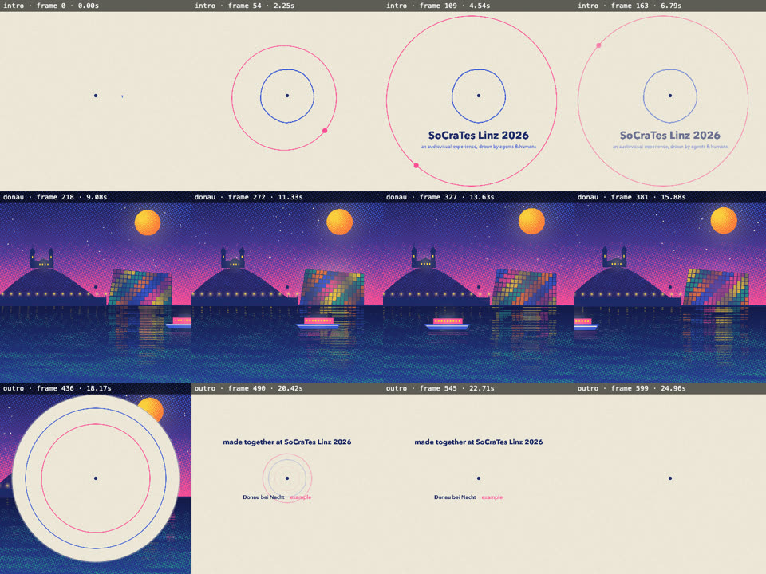

# Creating Audiovisual Experiences using Agents
Day One, 25th Sept. 2026, 18:00, room 08-08

A short, explorative open-space session: how could an agent make short videos like the ones below, and could it do the music too?
In about 10 minutes, a coding agent built a very rough first draft: a tiny frame-by-frame "film engine", one example scene (the Danube at night in Linz), a code-generated soundtrack and a 25-second MP4.

This is an exploration, not a finished tool or a polished film.

## What inspired it
* [Claude Code-made video, Remotion-style](https://x.com/andrewjiang/status/2102987981695132140)
* ["Claude Opus 5 drew every frame of this animation using JavaScript"](https://x.com/kevin_t_ngo/status/2099477219877978289)
* [The same animation discussed on Reddit](https://www.reddit.com/r/ClaudeAI/comments/1wgvklo/claude_opus_5_drew_every_frame_of_this_animation/)

What they have in common: there is no image model. Every frame is drawn by code, and a headless browser acts as the camera.

## The rough first draft


[Watch the first draft with sound (MP4, 25 s)](media/first-draft.mp4)

GitHub doesn't play repo-relative videos inline. Clicking the link opens it.

## How it works (short)
* **A frame is a pure function of time:** each scene exports `draw(ctx, f)`, with no animation state and no `Math.random`, so frame 137 always looks the same.
* **Headless Chrome is the camera:** it renders frame by frame and pipes the PNGs into ffmpeg to make the MP4.
* **Shared rules make scenes by different people fit together:** a fixed palette, a halftone "risograph" look, circle-portal transitions and a centre dot. These live in [AGENTS.md](AGENTS.md).
* **Music and picture share one grid:** 96 BPM, 4/4, so 1 bar = 2.5 s = 60 frames. Scene lengths are counted in bars, so cuts land on the music.
* **Two music paths:**
  * `music/track.js`: Web Audio, rendered offline to a WAV
  * `music/soundtrack.strudel.js`: for live coding on [strudel.cc](https://strudel.cc)
* **The agent "sees" its work** by rendering contact sheets (`npm run stills`), then critiques and fixes it.

## Try it yourself
Needs Node 20 or later, ffmpeg and Google Chrome (or set `CHROME_PATH`).

```bash
npm install
npm run dev                        # live preview at http://localhost:5173
npm run stills -- --scene donau    # contact sheet in out/stills/donau.png
npm run music                      # soundtrack in music/soundtrack.wav
npm run render                     # whole film with sound in out/film.mp4
```

## If we had more time
* Everyone prompts one Linz scene.
* Jam the soundtrack live in Strudel.
* Run parallel agents in git worktrees.
* Make scenes audio-reactive.

## Related tools
* [Remotion](https://www.remotion.dev/docs/ai/claude-code): the same idea in React, with agent skills
* [HyperFrames](https://github.com/heygen-com/hyperframes): HTML-to-MP4, built for agents
* [Strudel](https://strudel.cc): live coding music in the browser
* [Strudel MCP server](https://github.com/williamzujkowski/live-coding-music-mcp): lets an agent drive Strudel directly
